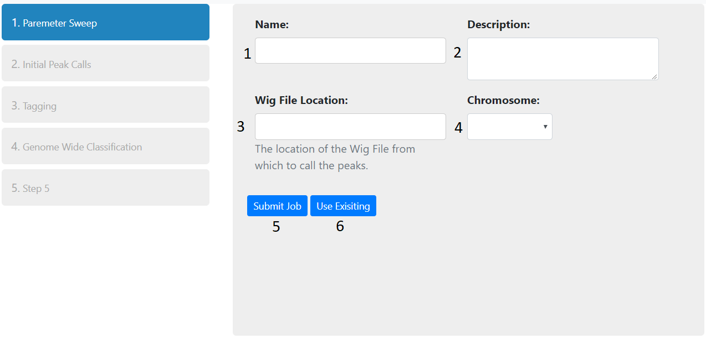
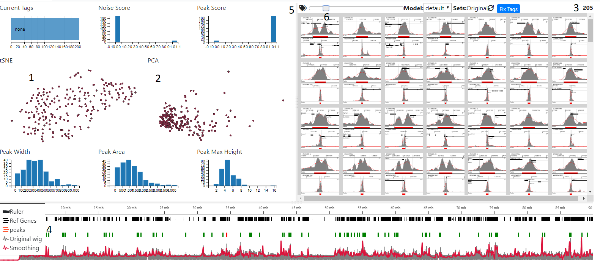
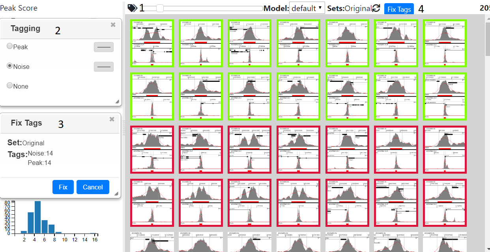
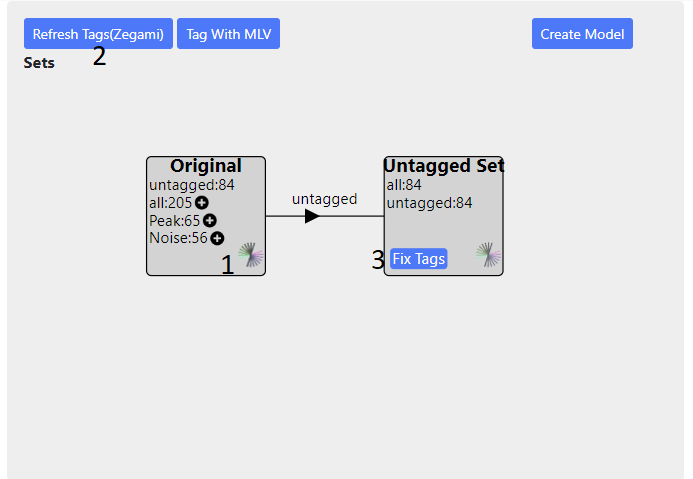
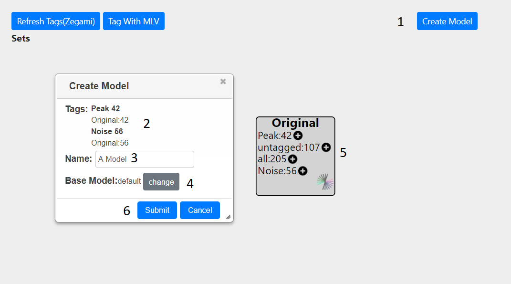
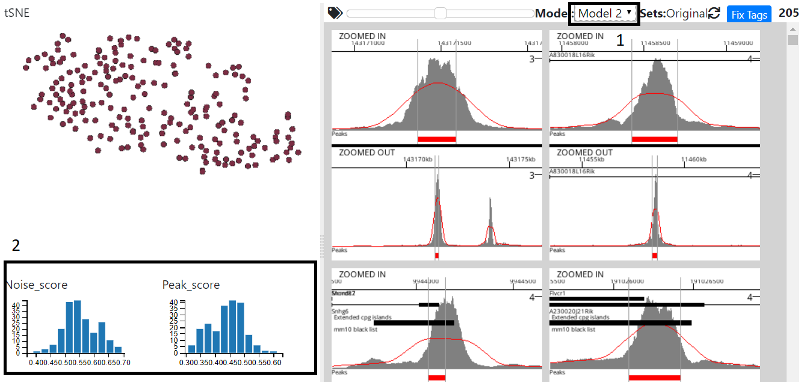
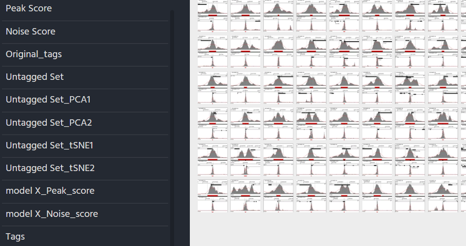
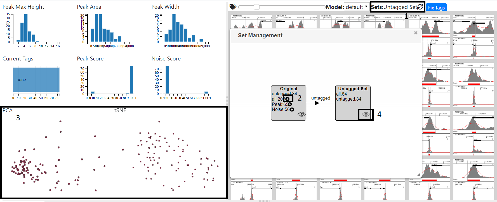
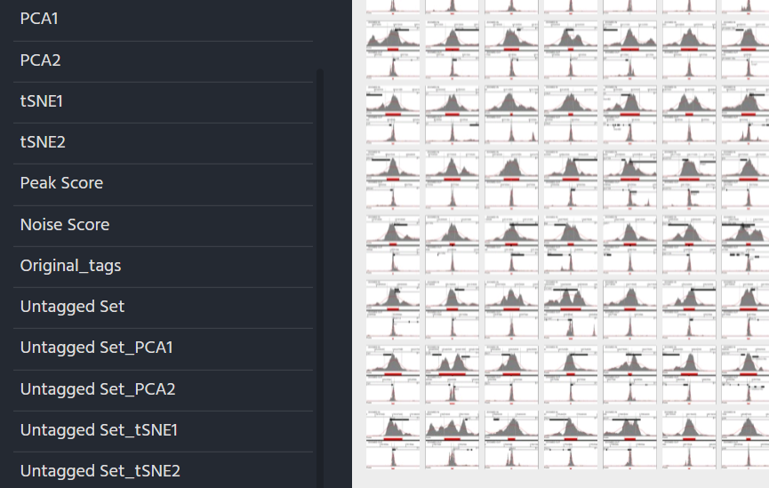
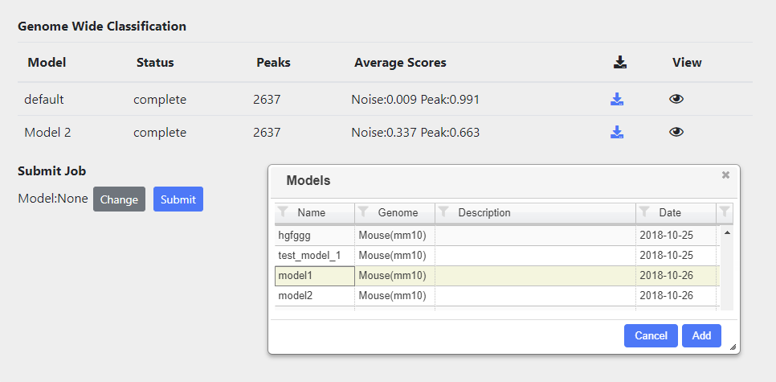

Peak Search
======================================

Summary
--------------

Peak Search allows you to call peaks from a wig file and classify them. Initially peaks are only called on a single chromosome. From this the correct parameters and a model can be chosen in order to call peaks on the entire genome. The following steps are required:-

- **Parameter Sweep** Peaks are called on a supplied Wig file out using a number of different parameters. A bed file is created for each combination of parameters.
- **Initial Peak Calling** The initial peak calling can be analysed by looking at how changing different parameters effects the distribution of the peaks. From this, the appropriate parameters are chosen and images and stats are generated for all peaks generated with the chosen parameters
- **Tagging/Create Model** From the peak images and stats, the peaks can be tagged (classified) by the user into different categories. These categories can then submitted to a machine learning step, which generates a model.
- **Genome Wide Classification** Peaks are called and classified on the whole genome using the default model. In addition, newly generated models used for genome wide classification.

Parameter Sweep
-----------------

1. Type the name and description of the project into the inputs (1 and 2 above)
2. Enter the http address of a publically accessible  Wig file into the text box(3). Once you have pressed enter or lost focus, the path entered will be checked to see if it is indeed a wig file and then the chromosomes displayed in the right hand drop down (4) for you to choose from.
3. You can submit the job by pressing the appropriate button(5) An email will be sent once the initial peak calling has finished.. You can also return the page to check the status

If you just want to choose different parameters from a parameter sweep that has previously been carried out, then press 'Use Exisiting' (6) and choose the appropiate sweep.

Initial Peak Calling
-----------------------
Choosing Parameters
+++++++++++++++++++++++

Processing Peaks
+++++++++++++++++++++++

.. image:: img/peak_search/initial_peak_calls.png
   :alt: alternate text
   :align: center

Once the parameters have been chosen and submitted, the following steps will be carried out on all the peaks 
identified on the selected chromosome:-

* Peak statistics (width, height, area) are calculated
* Overlap with any genes, annotations are calculated
* Thumbnail created for each peak
* tSNE and PCA carried out bases on peak shape
* Peaks are classified using the default model and assigned a Peak and Noise score
* Images are uplaoded to Zegami and a collection is created

You will be informed about which stage is currently running. You do not have to remain on the page, but can return to it later to see
if all the processing has been completed.

Also, whilst the above is being carried out, peaks for the whole genome (not just the specified chromosome)
will be called and classified according to the parameters initially chosen and the default model.

Once processing is complete, you will have access to the Tagging/Create Model and Whole Genome Classification tabs.

Tagging\Creating Model
---------------------------------

Tagging Using MLV
++++++++++++++++++++++++

General Navigation
......................
Press the 'Tag With MLV' button ob the Tagging/Create Model panel and you will be taken to the MLV page

Initially all the peaks will be shown in the right-hand tab and the the total number on the far right (3)
The graphs on the left show peak statistics, clustering (tSNE/PCA) and also scores given to the peaks using the
default model. In addition, overlap with any annotations will also be shown in pie charts, if this was specified.

Peaks can be filtered by selecting areas on the graphs in the left hand panels. Areas in the scatter plots 
can be selected by pressing shift and dragging the mouse. Normal dragging will cause panning and zooming
can be achieved using the mouse wheel. Filtered peaks are also reflected in the bottom browser window and
are coloured by Peak score from green (score=1) to red (score =0).Image size can be altered using the slider (6)

Tagging Images
................

Pressing the tag icon (4) will open the tagging dialog, now clicking on an image will then tag that image with the tag selected in the dialog,
or remove the tag, if none was selected. Multiple images can be tagged at once,  by pressing shift and clicking, which
tags all the images between the last and currently tagged item. Closing the tagging dialog will remove coloured border from the image, but not remove
the tags, and the images will become highlighted again once the dialog is reopened.

Once enough tags have been selected the tags need to be fixed with the 'Fix Tags' button (4). This opens a dialog which shows the current set, which initially will
be original. If enough images have been tagged you can the proceed by pressing the 'Fix' button . This stores all the tags in a database and allows a model to 
be created from them.

Tagging Using Zegami
++++++++++++++++++++++++

Click the Zegami icon to go to the Zegami set (1),  you need to login `here <https://app.zegami.com/accounts/login/>`_ using
the correct password/username, otherwise a request error will be shown on the page. Then tag the sets in Zegami,
see the `Zegami web site <https://zegami.com/>`_  for instructions on how to tag images.
When you have finished tagging, you will need to return to the main project page to proceed. Every time the project page is loaded it will
retrieve the current tags from Zegami, but this can also be done manually, with the 'Refresh Tags' button (2). Once you are happy with the tags, press the 
'fix tags' button (3). Once the tags are fixed you can create a model see `Classifying/Generating a Model`_

Classifying/Generating a Model
+++++++++++++++++++++++++++++++

Pressing the 'Create Model' button (1) will bring up a dialog, showing the number and type of peaks which have been tagged (2)
The source of these tags is also shown. In this example, only the original set is present (5) hence all tags are taken from this.
If other sets are present, for each peak, the tag will be taken from the last created set, if there is not one present, then 
the next set will be examined for tag and so on until the original set is reached.

An appropriate name should be given to the model (3). The base model can also be changed from default to a previously created one (4).
Finally, the model can be submitted(6)
At the top of the screen, a message will show that the model is being created and a dialog will appear to inform you when the job is
finished. Once the model has been created you can view it either in Zegami or MLV. The model can then be used to call peaks genome
wide.

Viewing in MLV
................

Select the model in model dropdown (1) and the Noise,Peak Score graphs will update to reflect the new model

Viewing in Zegami
.....................

For each model created An extra field will be added to the original zegami collection with the title model_name tag score
(see above)

Working with Sets
+++++++++++++++++++++
In MLV
............

The set dialog can be opened by clicking on the sets label (1). Once tags have been fixed, pressing the plus sign
next to a tag (2) will create a new set. This may take a while as peaks are re-clustered. Once this is complete
the view will automatically change to the reflect the set, with the charts showing the new
clustering (3). You can than tag this set and fix the tags in the normal way - see `Tagging Using MLV`_
To switch between sets press the eye icon and the graphs and images will update accordingly. As the number of setsexpands,
you can zoom (mouse wheel) and pan (mouse drag)in the diagram.

In Zegami
............
Sets can be created in the Tagging/Create Model tab of the main project page. Once tags have been fixed in a set,
pressing the plus icon next to a tag will create a set from those tags (see above). Once the set has been
created, it can be viewed in Zegami (using the zegami icon in the set), although you may have to wait a while for the set to be processed.

The new zegami collection will consist only of items in the new set and contain extra fields for PCA/tSNE1, which
are prefixed with the set name.The set can be tagged and fixed in the normal way `Tagging Using Zegami`_

For each set created, all the fields relevent to the sets (tSNE/PCA, tags) will also be added to the original Zegami collection
(prefixed with the set name) allowing comparison between sets

Genome Wide Classification
------------------------------

Peaks in the whole genome are tagged and classified according to the model chosen. Classification automatically
runs for the default model. Other models can also be rub and these can be selected by using the 'change' button and
then selecting the appropriate model from the table.

All classifications, either running or complete are shown in the table. Once complete the Average scores
of each tag submiited will be displayed, as well as icon which allows downloading of a bigbed file containing all the peak calls
and associated scores.

You can aslo view the results of the classification in a viewer by presssing the eye icon.

 
